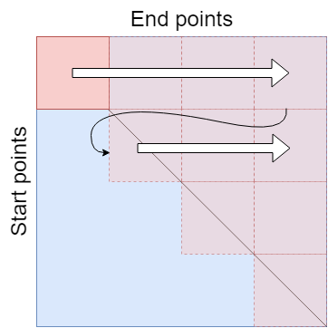

# Assignment report on OpenMP (hpcgp038)

## Program layout

Given a file containing the three dimensional positions of multiple cells the following program calculates the distance between all cells, sorts the distances and outputs how many times each distance occurs. To solve the task the entries of a N times N matrix have to be computed, where N is the number of cells. We call this matrix the cell matrix. The cell positions representing the rows will be called start cells, or start positions and the corresponding cell positions representing the columns will be called end cells or end positions. Consider the element (i, j) of the cell matrix to be the distance from cell i to cell j. Since the matrix is symmetric, only the upper triangular matrix has to be calculated. The diagonal elements will all be zero and need not be calculated.

A problem associated with this task is that large N will require a lot of memory to store the cells. The naïve way of solving the problem - loading all N cells at once and computing the whole matrix - can lead to the consumption of more memory than what is reasonable for a program.

A solution to this problem is to only calculate a part of the cell matrix at a time. See figure 1 to visualize the idea. We define a buffer size that is acceptable. Let M be the number of points that the buffer is able to store. Then M/2 start cells and M/2 end cells are read from the file and stored in the buffer. The corresponding block of entries in the cell matrix are calculated and stored in an output array. By setting the size of the output array to the number of every possible distance and then only incrementing the correct index every time a distance is calculated, sorting is avoided. This output array will be of small size due to the constraints of the problem. The scheme is repeated until all distances have been calculated.

### main
- Takes input "-tX", where X is the number of threads to be used.
- Opens the file containing cell information
- Allocates memory for the two buffers start_points and end_points. In order to comply with memory constraints one must make sure that 2 * POINTS_PER_BUFFER * sizeof(Point) < maximum memory usage.
- do while loop: Reads two sequences of cells corresponding to start cells and end cells, for which the distances are to be computed. return_value will indicate the properties of the acquired sequences. A value of 1 means that the sequences are equal and that they represent a block on the diagonal in the cell matrix. A value of 0 means that the sequences represent a block of cells not on the diagonal and 2 indicates that we are done (all cell combinations have already been accounted for). The while loop breaks when the value 2 is obtained. Depending on if return_value is 0 or 1 two different calculation functions are called, that calculate the cell distances in a rectangular or triangular block in the cell matrix.
- A loop then converts the computed distances and their count to a character array, which is printed to stdout.

### Point
~~~~ c
typedef struct{
	short x, y, z;
} Point;
~~~~
- Contains the x, y, and z positions of a cell. The type short is used to reduce memory use.

### read_points
- Description of function: read_points tries to calculate a new block of entries in the cell matrix. First the top left block is obtained and after that the function attempts to find a new block on the right side of the old one. If the end of a row is reached the next block will be on the diagonal underneath the previous level. When a block of entries has been calculated the values are stored in an output array.

- Input arguments:
	- FILE * restrict input_file, reference to the file containing cells.
	- Point start_points[], array in which to store the first sequence of cells.
	- Point end_points[], array in which to store the second sequence of cells.
	- size_t * restrict start_buffer_size, pointer used to store the size of the first sequence of cells.
	- size_t * restrict end_buffer_size pointer used to store the size of the second sequence of cells.
- Return value: the function output indicates whether the two sequences of cells are identical (1) or not (0), or if there are no more cells to read (2).
- Variables
	- bytes_read is used to track how many cells were read from the file.
	- position_in_file tracks the position in the file of the first sequence of cells.
	- file_content is used to temporary store information that is being read.
- First the function checks if position_in_file equals zero or if we are at the end of the file. If the first case is true, it means that no sequence of start points has been read. If so the first block of the matrix must be obtained. Using fread the sequence of cells is stored in file_content. Then, str2point extracts the cells and saves the positions in start points. Since we are at a diagonal, the end points will be identical to the start points and they are copied from start_points using memcpy. Now, consider the second case tested in the if statement to be true. This means that we have reached the right side of the matrix. Then we must find a new sequence of start points so we seek in the file to find the next diagonal block to read. Then the sequences are stored as before. However, being at the end of the file can also mean that the whole matrix has been traversed. If bytes_read is 0 it would indicate that the end of the matrix has indeed been reached and the function can return 2 to signal this.
-If position_in_file is non zero and the end of the file has not been reached, then a new block of entries can be found immediately to the right in the cell matrix. Hence the sequence of start points must not be updated, only the end points. In this case, it is certain that a rectangular block of cells has been obtained in contrast to within the if statement, where only the elements in the upper triangular block are relevant.
-Parsing char values to coordinates of a point is done in parallel to increase perforance

### calc_block
- Finds the distances between points corresponding a rectangular block of the cell matrix.
- Input arguments:
	- const Point start_points[], array of points representing the column values of a block in the cell matrix.
	- const Point end_points[], array of points representing the row values of a block in the cell matrix.
	- const size_t start_length, the height of the block.
	- const size_t end_length, the width of the block.
	- unsigned int output[], the array used to count the frequency of distances.
- A double for loop traverses all positions of the block in the cell matrix. For each position the distance between the current points is calculated using point_index. Two points are calculated in every loop iteration.
- Calculates distances and increments occurence of distances in output vector in parallel for better performence. 

### calc_triangle
- Finds the distance between all points in a triangular block of the cell matrix.
- Input arguments:
	- const Point start_points[], array of points representing the column values of a block in the cell matrix.
	- const Point end_points[], array of points representing the row values of a block in the cell matrix.
	- const size_t length, the height and width of the block.
	- unsigned int output[], the array used to count the frequency of distances.
- A double for loop traverses all positions of the upper triangular block. For each position the distance between the current points is calculated using point_index. Two points are calculated in every loop iteration.
- Calculates distances and increments occurence of distances in output vector in parallel for better performence. 

### point_index
- Performs the calculation of the distance between two points.
- Input arguments:
	- const Point p1, p1 represents the first point.
	- const Point p2, p2 represents the second point.
- Used sqrtf instead of sqrt since we only need single precision.
- Returns a short containing the Euclidian distance between p1 and p2.

### str2point
- Converts three positions from a char array to a Point.
- Input arguments:
	- char * restrict constant str, represents a three dimensional point. Must be formatted as "x_position y_position z_position", where each position is formatted as "SAB.CDE", S = + or -, A-E are digits.
	- Point * restrict p, pointer used to store the obtained Point.
- For better performance the conversion from char type to short integer is not implemented using function atoi(), but rather char arithmetic and implicit cast.
- Ailiasing is used through the keyword restrict in order to reduce number of loads.
- All three coordinates are parsed to short before accessing pointers and storing as point type.

### index2str
- Converts the cell distance from short to string for output.
- Input arguments:
	- char * str, pointer used to store the results.
	- short s, a cell distance expressed as a four digit integer.
- As in the str2point function we implement arithmetic on the char types and implicit cast insead of corresponding function itoa(). 

### i2str
- Converts an int to char[]. It is used to convert the count of how many times a distance appears.
- Input arguments:
	- char * str, pointer to store the output.
	- int i, the integer to be converted.

## Maximal memory consumption

The maximal memory allocated may at no time exceed 1024^3 bytes. We can do a rough estimate of the maximal memory usage by adding allocated memory for the largest set of distances. 

- Coordiantes for every point are assumed to lie in the interval [-10,10], by calculating the maximal distance between two points in the three dimensional hypercube defined by said intervals we can compute the maximal number of distances rounded to two decimals. The maximum distance is \sqrt{3*(10-(-10))^{2}}=3465. Hence we know that a vector containg all possible distances stored as type int is of size 3465 * 4 = 13.824 KB.

- The start_point_buffer allocates 2 * POINTS_PER_BUFFER * sizeof(Point), where POINTS_PER_BUFFER is a constant set to 100 000, the size was determined after som testing for better performance. Point is a struct containing 3 shorts which adds up to 6 bytes of allocated memory per point. Total memory allocated for the buffer thus becomes 2 * 100 000 * 6 = 1.2 MB.

- Only parts of the input file are read at a time and are stored in a buffer, file_content, which allocates memory for 10000 points. Each point is stored on an entire line, containing 24 char elements. POINTS_PER_BUFFER * 24 * sizeof(char) = 100 000 * 24 * 1 = 240 KB.

-For the output string, each line consist of 20 char elements and should be big enough to store every possible distance. 20 * OUT_BUFFER_SIZE * sizeof(char) = 20 * 3465 * 1 = 69.120 KB.

-We should also take additional variables into account but they are comperativily small. Using a very generous estimate we can say that they never exceed 1000 bytes of memory.

-We can therefore guarantee that the total allocated memory should never exceed: 1 200 000 + 13 824 + 240 000 + 69 120 + 1 000 bytes = 1.524 MB << 1 GB.

## Performance
The first step for the program is to read data from the "cells" file. To reduce the number of reads and jumps in the file it reads to the "start_points[]"-buffer first, uses "memcpy()" to transfer this data to "end_points[]". If we aren't at EOF, the next time we read we only need to read into "end_points[]" and keep "start_points[]". The reading function keeps track of position in file for "start_points[]" and jumps there as soon as EOF is reached for "end_points[]". This way we only need to read half as many points in total (see figure above).
To increase locality, "start_points[]" is allocated to be 2\*POINTS_PER_BUFFER and "end_points" points to the middle element, i.e the buffers are contigiuous in memory.

The parsing from text to points is done in parallel with a "parallel for" pragma. We found no significant improvement when we scheduled this task.
The parsing function, "str2point()" first converts the string values of each coordinate into local short variables before accessing the given Point structure. This way we do all the calculations, then access, opposed to calculate, access p.x, calculate, access p.y... and it gave an increased performance.

The majority of the time is spent on calculations of the distance, and the conversion to an index for the occurance vector. To these calculations efficiently we express the distance formula in factorized form inside the sqrt ((x1-x2)(x1-x2)+...) to reduce the number of terms and mixing of terms. This should in turn reduce the number of operations and may also reduce the number of times each element needs to be fetched from cache/memory inside that function.
Our first implementation used "sqrt()" which returns a double precision float value. We then tried "sqrtf()" which return a single precision float (even that is more precision than we need) and noticed an improvement of about 10% in execution time. Later on, after we tweaked the parallelization for perforamance, we tried "sqrt()" again, but this time this we got a peformance increase close to 10%(!) and we are not sure why this is the case.

The calculations are done using double for loops. If the "start_points[]" and "end_points[]" buffers contain different points we have a rectangular block and no interdependence in the two for loops, which enables us to include a "collapse(2)" into the pragma. The block can be divided into equally sized chunks and because of this we use a scheduler and include "schedule(static,chunk_size)" into the pragma. This gave a increase in performance. When the buffers are the same, i.e a triangular block the for loops have an interdependence and "collapse(2)" is not an option. Furthermore, it is difficult to split it up into equally sized blocks and the work load is uneven for the threads. We therefor used a dynamic scheduler instead and this gave a positive effect on performance. In both cases the chunk sizes depend on the buffer length and the number of threads. It should be large enough to occupy the threads for a while before going to/asking for a new chunk. Array reduction is used in both instances and the increase was huge. The reduction greatly decreases the number of writes to the occurance array. If a "critical" or "atomic" pragma was used, the occurance array would need to be fetched from shared memory every time a write occurs one core.

Since the distance between two points is random, the access to the occurance array is random. We are also accessing the point buffers right before we access the occurance array. The occurance array is small enough to, in theory, fit as a whole in the L1 data cache, but when we consider the access to the point buffers, the occurance array may not be stored as a whole there and has to be fetched from slower memory. However, the distances are basically normal distributed with a mean towards the middle. Chances are then that two succeeding points lie very close to eachother and both points may lie in the L1 cache.
Perf showed that 509 386 832 L1 data cache misses happend, which is around 10% of the total number of points.

We timed and averaged the execution time of our program.

|Points in file|Threads|Average run time|Goal time|
|--------------|-------|----------------|---------|
|10 000        |1      |0.170 s		|0.410 s  |
|100 000       |5      |3.095 s         |8.200 s  |
|100 000       |10     |1.595 s         |4.100 s  |
|100 000       |20     |0.815 s		|2.600 s  |
